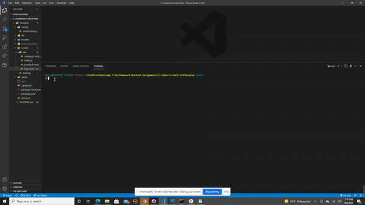

# E-Commerce-Back-End

# Description

This app is working backend of an e-commerce website. we needed to create a working express.js API to use sequelize to interact with a mysql database.

# How To Use

User can use this to help manage their e-commerce website by adding, modifying and deleting products in their inventory so they can easily and smoothly keep an up to date website with the latest products!

# Technology Used

- Javascript
- MySql
- Node.js
- Express
- Sequelize
- Api's
- Insomnia (checking routes)

# GIF SHOWING ALL GET, POST, PUT and DELETE routes

# Contact 

Any questions or concerns about this app, please contact me:

Github: https://github.com/kaivont85
Email: kaivont@gmail.com
